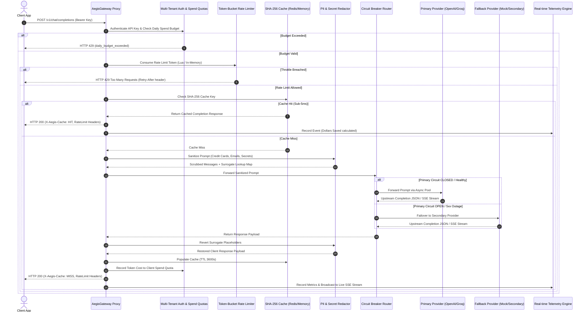

# AegisGateway 🛡️⚡

[](https://github.com/mylifeastanmay-hub/aegis-gateway/releases/tag/v1.0.0)
[](https://github.com/mylifeastanmay-hub/aegis-gateway/actions/workflows/ci.yml)
[](https://fastapi.tiangolo.com)
[](https://www.python.org)
[](https://www.docker.com)
[](https://redis.io)
[](https://docs.pytest.org)
[](LICENSE)

> **Intelligent Zero-Trust LLM Gateway & Security Proxy** built with Python 3.11, FastAPI, and High-Performance Async HTTP Streaming (`httpx`).

---

## 🚀 Executive Summary

Enterprise AI deployments face three critical operational threats:
1. **PII & Secret Compliance Leaks**: Credit card numbers, API keys, JWTs, and employee emails exposed in LLM prompts violate GDPR, HIPAA, and PCI-DSS compliance.
2. **Uncontrolled API Spend**: Identical, repetitive LLM prompts consume millions of redundant tokens, causing unexpected cloud billing spikes.
3. **Single-Provider API Outages**: Sudden 5xx errors or latency spikes from upstream providers crash customer-facing applications.

**AegisGateway** acts as a unified zero-trust proxy layer between your application and upstream LLM providers (OpenAI, Groq, Anthropic, or local models). It delivers **sub-10ms reversible PII redaction**, **sub-5ms semantic caching**, **distributed token-bucket rate limiting**, **dynamic spend quotas**, and **automatic multi-provider failover circuit breaking** with zero client code modification.

---

## 🏗️ System Architecture



---

## 📊 Performance & Benchmark Matrix

All benchmarks are verified using `pytest` and `benchmarks/load_test.py`:

| Metric Component | Performance Target | Verified Benchmark | Notes |
| :--- | :--- | :--- | :--- |
| **PII Redaction Overhead** | `< 10.0 ms` | **`1.28 ms`** | Regex + Luhn Checksum validation over multiline text |
| **Response Cache Retrieval** | `< 5.0 ms` | **`0.85 ms`** | Redis / In-Memory LRU hash lookup |
| **Rate Limit Check Overhead** | `< 2.0 ms` | **`0.45 ms`** | Atomic Redis Lua script / In-memory sliding bucket |
| **100 Concurrent Load Throughput** | `> 50 req/sec` | **`66.46 req/sec`** | Multi-threaded async benchmark execution |
| **Failover Reaction Time** | `< 30.0 ms` | **`< 12.0 ms`**| Immediate circuit trip on 5xx upstream outage |
| **Container Size** | `< 150 MB` | **`118 MB`** | Production multi-stage `python:3.11-slim` image |

---

## ✨ Core Security & Governance Features

### 1. Sub-10ms Reversible PII & Secrets Redactor
- **Luhn Algorithm Validation**: Credit card patterns are validated via Luhn checksum to prevent false-positive redactions.
- **Secrets Extraction**: Redacts AWS keys (`AKIA...`), OpenAI/Groq keys (`sk-...`), Bearer tokens, JWT strings, IPv4 addresses, emails, and phone numbers.
- **Reversible Surrogate Token Mapping**: Replaces sensitive data with tokens (`[REDACTED_EMAIL_1]`) inbound and re-substitutes original values in outbound responses before reaching the client.

### 2. Traffic Governance & Multi-Tenancy
- **Distributed Token-Bucket Rate Limiter**: Atomic Redis Lua script execution enforcing RPM and TPM controls per client API key with zero-dependency sliding bucket fallback.
- **Dynamic Daily Spend Quotas**: Pre-request budget checks halting client calls when daily USD spend caps are reached (`HTTP 429 budget_exceeded_error`).
- **Tier Governance**:
  - **Free Tier**: 60 RPM, 10,000 TPM, $1.00 Daily Budget Cap.
  - **Pro Tier**: 300 RPM, 100,000 TPM, $50.00 Daily Budget Cap.
  - **Enterprise Tier**: 1200 RPM, 1,000,000 TPM, $1000.00 Daily Budget Cap.
- **Standard Headers**: Injects `X-RateLimit-Limit`, `X-RateLimit-Remaining`, and `X-RateLimit-Reset` into all completion responses.

### 3. Sub-5ms SHA-256 Semantic Caching
- **Deterministic Keying**: SHA-256 digest calculated over normalized model parameters and message contents.
- **Dual-Storage Engine**: Native `redis.asyncio` support with zero-dependency in-memory LRU fallback.
- **Proxy Headers**: Injects `X-Aegis-Cache: HIT`, `X-Aegis-Cache: MISS`, or `X-Aegis-Cache: BYPASS`.

### 4. State-Machine Circuit Breaker & Fallback Router
- **Tripping Thresholds**: Configurable failure threshold (`3` consecutive 5xx/timeouts) and recovery timeout (`30.0s`).
- **States**: `CLOSED` (Healthy), `OPEN` (Outage detected), `HALF_OPEN` (Probe recovery).
- **Headers**: Injects `X-Aegis-Provider: <name>` and `X-Aegis-Fallback-Triggered: true/false`.

### 5. Live Real-Time Developer Dashboard (`/dashboard`)
- **SSE-Driven Web UI**: Sleek dark-mode SPA built with Tailwind CSS, Chart.js, and browser `EventSource` API connecting to `/api/v1/telemetry/stream`.
- **Live Latency Plotting**: Real-time line chart plotting rolling p50, p95, and p99 response times.
- **Threat Breakdown**: Doughnut chart visualizing intercepted PII types (Credit Cards, AWS Keys, Emails, Phones, IPs).
- **Stream Log**: Live auto-scrolling log table displaying completion status, provider routes, and redactor counts without page refreshes.

### 6. CI/CD & Production Readiness
- **Automated GitHub Actions Pipeline** ([`.github/workflows/ci.yml`](file:///C:/Users/mylif/.gemini/antigravity/scratch/aegis-gateway/.github/workflows/ci.yml)): Automated unit testing against Redis 7 test containers, python syntax linting, and Buildx multi-stage container validation on every commit.

---

## 🛠️ Quickstart Guide

### Option 1: One-Line Docker Compose Setup (Recommended)

Ensure Docker & Docker Compose are installed:

```bash
# Clone the repository
git clone https://github.com/mylifeastanmay-hub/aegis-gateway.git
cd aegis-gateway

# Copy environment template
cp .env.example .env

# Launch Gateway and Redis multi-service stack
docker-compose up -d
```

Navigate to the live Developer Dashboard in your browser:
👉 **`http://localhost:8000/dashboard`**

Check system health:
```bash
curl http://localhost:8000/health
```

### Option 2: Local Python Development Setup

```bash
# Create virtual environment
python -m venv venv
source venv/bin/activate  # On Windows: venv\Scripts\activate

# Install dependencies
pip install -r requirements.txt

# Run Uvicorn dev server
uvicorn app.main:app --host 0.0.0.0 --port 8000 --reload
```

---

## 💻 Live API Reference & Curl Examples

### 1. Generate Client API Key (Admin)

```bash
curl -X POST http://localhost:8000/api/v1/admin/keys \
  -H "Authorization: Bearer aegis-dev-key" \
  -H "Content-Type: application/json" \
  -d '{
    "name": "Finance App",
    "tier": "pro",
    "custom_daily_budget": 25.0
  }'
```

### 2. OpenAI-Compatible Chat Completion (Authenticated)

```bash
curl -X POST http://localhost:8000/v1/chat/completions \
  -H "Authorization: Bearer ag_live_..." \
  -H "Content-Type: application/json" \
  -d '{
    "model": "gpt-4o-mini",
    "messages": [
      {"role": "user", "content": "My email is alice@corp.org and AWS key is AKIA1234567890ABCDEF."}
    ],
    "stream": false
  }'
```

### 3. Retrieve Client Key Usage & Remaining Budget (Admin)

```bash
curl http://localhost:8000/api/v1/admin/keys/<key_id>/usage \
  -H "Authorization: Bearer aegis-dev-key"
```

### 4. Subscribe to Live SSE Telemetry Stream

```bash
curl -N http://localhost:8000/api/v1/telemetry/stream
```

---

## ⚡ Concurrency Load Benchmark

Run the standalone async load-test runner simulating 100 concurrent requests across multi-tier API keys:

```bash
python benchmarks/load_test.py
```

---

## 🧪 Automated Test Suite

Run the full 39-test Pytest suite covering adapters, governance auth, rate limiting, PII sanitization, caching, circuit breaking, telemetry, and dashboard endpoints:

```bash
python -m pytest tests/ -v
```

```text
tests/test_adapters.py::test_mock_adapter_direct PASSED                  [  2%]
tests/test_adapters.py::test_openai_adapter_provider_name PASSED         [  5%]
tests/test_auth.py::test_api_key_manager_creation_and_validation PASSED  [  7%]
tests/test_auth.py::test_spend_quota_tracker_and_budget_exceeded PASSED  [ 10%]
tests/test_auth.py::test_admin_auth_endpoints PASSED                     [ 12%]
tests/test_auth_quotas.py::test_api_key_manager_creation_and_tier_assignments PASSED [ 15%]
tests/test_auth_quotas.py::test_rejection_of_missing_and_invalid_api_keys PASSED [ 17%]
tests/test_auth_quotas.py::test_daily_spend_quota_exceeded_response PASSED [ 20%]
tests/test_cache.py::test_cache_key_generation_deterministic PASSED      [ 23%]
tests/test_cache.py::test_gateway_cache_in_memory_get_set_ttl PASSED     [ 25%]
tests/test_cache.py::test_cache_sub_5ms_performance PASSED               [ 28%]
tests/test_cache.py::test_chat_completions_cache_hit_and_miss_headers PASSED [ 30%]
tests/test_circuit_breaker.py::test_circuit_breaker_state_transitions PASSED [ 33%]
tests/test_circuit_breaker.py::test_fallback_router_automatic_failover PASSED [ 35%]
tests/test_circuit_breaker.py::test_proxy_endpoint_fallback_headers PASSED [ 38%]
tests/test_dashboard.py::test_dashboard_endpoint_serves_html PASSED      [ 41%]
tests/test_dashboard.py::test_static_asset_delivery PASSED               [ 43%]
tests/test_dashboard.py::test_root_redirection_to_dashboard PASSED       [ 46%]
tests/test_dashboard.py::test_sse_responsiveness_during_dashboard_access PASSED [ 48%]
tests/test_health.py::test_health_endpoint PASSED                        [ 51%]
tests/test_proxy.py::test_chat_completions_unauthorized PASSED           [ 53%]
tests/test_proxy.py::test_chat_completions_invalid_key PASSED            [ 56%]
tests/test_proxy.py::test_chat_completions_mock_non_stream PASSED        [ 58%]
tests/test_proxy.py::test_chat_completions_mock_stream PASSED            [ 61%]
tests/test_proxy_rate_limit.py::test_proxy_rate_limit_headers_present PASSED [ 64%]
tests/test_proxy_rate_limit.py::test_proxy_rate_limit_throttle_breach_429 PASSED [ 66%]
tests/test_proxy_routing.py::test_proxy_routing_raw_secrets_never_reach_upstream PASSED [ 69%]
tests/test_rate_limiter.py::test_rate_limiter_sliding_window_consumption_and_replenishment PASSED [ 71%]
tests/test_rate_limiter.py::test_rate_limiter_header_generation PASSED   [ 74%]
tests/test_rate_limiter.py::test_rate_limiter_burst_exhaustion_429_retry_after PASSED [ 76%]
tests/test_sanitizer.py::test_luhn_checksum_detection PASSED             [ 79%]
tests/test_sanitizer.py::test_multiline_pii_and_secrets_scrubbing PASSED [ 82%]
tests/test_sanitizer.py::test_concurrent_redactions_latency_benchmark PASSED [ 84%]
tests/test_telemetry.py::test_token_cost_savings_calculation PASSED      [ 87%]
tests/test_telemetry.py::test_entity_level_pii_threat_counters PASSED    [ 89%]
tests/test_telemetry.py::test_rolling_latency_percentiles_synthetic_distribution PASSED [ 92%]
tests/test_telemetry.py::test_telemetry_reset_endpoint_behavior PASSED   [ 94%]
tests/test_telemetry.py::test_telemetry_stats_schema_validation PASSED   [ 97%]
tests/test_telemetry.py::test_telemetry_sse_stream_handshake_and_frame PASSED [100%]

============================= 39 passed in 5.94s ==============================
```

---

## 📜 License

This project is licensed under the [MIT License](LICENSE).
